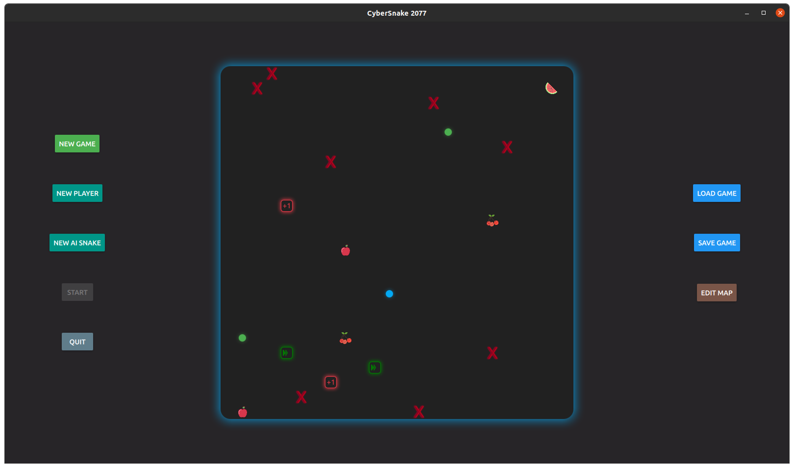

# CyberSnake 2077

https://github.com/markcty/CyberSnake2077

## Features

- Cyberpunk color scheme
- Minimalist Design
  - use circles to present a snake
  - use glow effect to give players atmosphere
  - the glow around the game board indicates the winner (cool)
- Fully animated
  - Almost all objects has a fade in or fade out animation
  - When moving the food to a wrong position, the food will spring back to its original position
- Up to 2 players + 2 AI snakes
- 3 different food
  - Plus Life
  - Accelerate
  - Color Allergy: only the snake with the right color can eat it, otherwise the snake died
- Implement user input stack to give players a fluent control

## Overview of codes

The core of the game is to maintain a two dimension array `board` which records all the objects on the game board. For example, if there is food on row 2 col 3, `board[2][3]` is a reference to that food object. If a snake spread across row 2~6 col 7, `board[2~6][7]` all refer to this snake object. When the snake moves or any food was eaten, the board is updated.

### How do the snakes move?

The snake is composed of multiple circle `SnakeBody`.  Each snake object has its own repeated `moveTimer`. Each time the `moveTimer` is triggered,  the snake destroys the tail `SnakeBody` and add a `SnakeBody` to its head according to direction. The moving speed can be easily modified by changing the interval of `moveTimer`.

### How is the key board input handled?

Keyboard input is passed to GameBoard. GameBoard will identify which snake should take this input and push the input into the snake's input stack.

### How are different kinds of food implemented?

All food (including brick) inherit from class `MapItem`. `MapItem` implements the dragging behavior and each food(brick) implements its own visual appearance. 

### How is the AI Snake implemented?

The mechanism of the AI Snake is simple. Every time the snake needs to move. It computes the score of every possible next move (3, actually) and choose the move with the highest score.

The score of next move is computed as below

- return -1 if next move kills the snake (smash to wall, brick or bite itself)
- +3 if nothing happened
- +5 if next move brings food closer
- +8 if next move is food
- +10 if next move can kill another snake

### How is the save game implemented?

The game is saved in json. The data need to be saved is stored in an object and parsed into Json. Json is written or read into/ from the file through a c++ backend `SaveGame`.

## Component implementation details

### main

`main.qml` builds the basic layout made up of 3 columns.

### GameBoard

GameBoard is one of the core parts of the game. It generates the board and maintains the game status.  It contains the a two dimension array `board` (see overview) and pass this array to all of its children (all the objects on the board, eg. snake, food ...).  Children are responsible for maintaining this array.

You can add property `players` or `aiSnakes` to create new player or AI snake. Change property `running` will start or pause the game. Change property `editMode` will enter or exit edit mode.

You can call `initRandomly()` or `initFromFile` to initiate the board. Calling `gerateItem(component)` or `randomlyGenerateItem(component)` will generate an item indicated by component on the map.

Snake will call `updateWinner()` to change GameBoard Glow indicating the winner

### Snake

Snake is another core part of the game. It describes the behavior of a snake (see overview).

When a `Snake` object is created, it will not immediately show on the board. Instead, you need to call `randomlyBirth()` or `birthFromFile()` to put the snake somewhere on the board.

When the snake is killed, it will call `rebirth()`, which checks the remaining life and destroy itself when there is no remaining life.

### ScoreBoard

Each snake has its own score board reference. A ScoreBoard is not activated until `activated=true`. Snake change `scores` and `lifes` to update the scoreBoard.

### MapItem

MapItem is a base calls for all the objects on the board(except snake). It use `MouseArea` to enable drag in edit mode. When an object is dragged outside the board, it will be deleted. If an object is dragged on top of some other MapItem, it will bounce back to its original place with an animation.

### Accelerate, PlusLife, Food, ColorAllergy, Brick

These are all objects inherited from MapItem.

