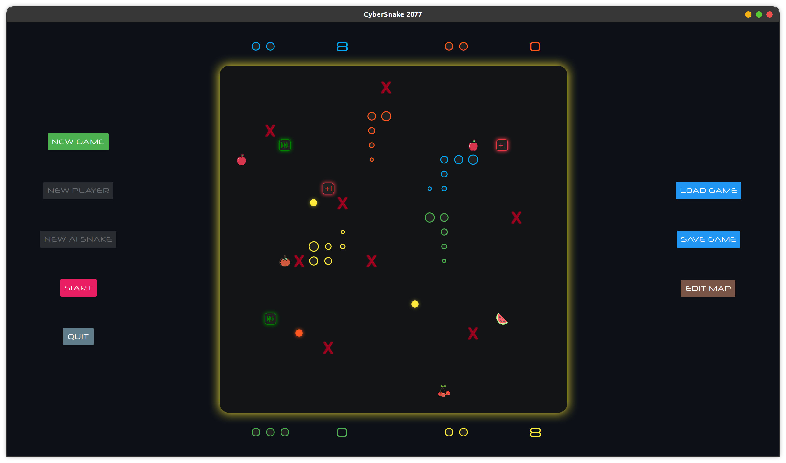

# CyberSnake 2077

## Features

- Cyberpunk color scheme
- Minimalist Design
  - use circles to present a snake
  - use glow effect to give players  some atmosphere
  - the glow around the game board indicates the winner (cool)
- Fully animated
  - Almost all objects has a fade in or fade out animation
  - When moving the food to a wrong position, the food will spring back to its original position
- Up to 2 players + 2 AI snakes
- 3 different food
  - Plus Life
  - Accelerate
  - Color Allergy: only the snake with the right color can eat it, otherwise the snake died
- Implement user input stack to give players a fluent control

## Overview of codes

The core of the game is to maintain a two dimension array `board` which records all the objects on the game board. For example, if there is food on row 2 col 3, `board[2][3]` is a reference to that food object. If a snake spread across row 2~6 col 7, `board[2~6][7]` all refer to this snake object. When the snake moves or any food was eaten, the board is updated.

### How do the snakes move?

The snake is composed of multiple circle `SnakeBody`.  Each snake object has its own repeated `moveTimer`. Each time the `moveTimer` is triggered,  the snake destroys the tail `SnakeBody` and add a `SnakeBody` to its head according to direction. The moving speed can be easily modified by changing the interval of `moveTimer`.

### How are different kinds of food implemented?

All food (including brick) inherit from class `MapItem`. `MapItem` implements the dragging behavior and each food(brick) implements its own visual presentations. 

### How is the AI Snake implemented?

The mechanism of the AI Snake is simple. Every time the snake needs to move. It computes the score of every possible next move (3, actually) and choose the move with the highest score.

The score of next move is computed as below

- return -1 if next move kills the snake (smash to wall, brick or bite itself)
- +3 if nothing happened
- +5 if next move brings food closer
- +8 if next move is food
- +10 if next move can kill another snake

## Component implementation details

### main

HW for SEP Project

- [x] start menu
- [x] snake
- [x] brick
- [x] normal food
- [x] pause
- [x] save game
- [x] restart
- [x] multiple players
- [x] special food 1
- [x] special food 2
- [x] special food 3
- [x] map editor
- [x] ai snake
